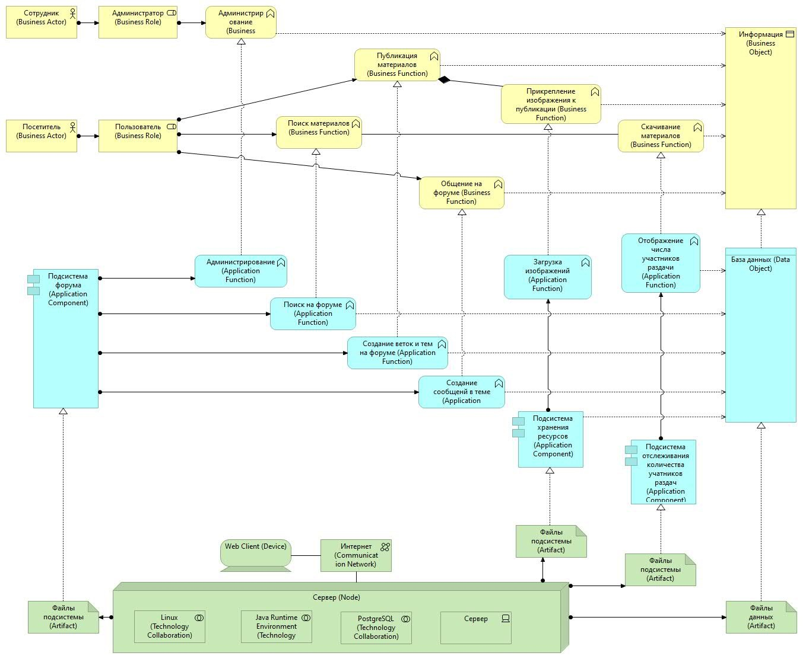

# Репозиторий ResourceService веб-приложения BitTorrent OpenShare.

	

# Что такое BitTorrent OpenShare?

BitTorrent OpenShare - мой дипломный проект УРФУ (Уральский федеральный университет) 2025. 

Веб-приложение представляет собой традиционный торрент-трекер по типу популярного rutracker.org.
Суть в том, что пользователи могут свободно делиться файлами, создавая тему на форуме. Файлообмен
происходит с помощью протокола [Bittorrent](https://www.bittorrent.com/). 

Благодаря этому пользователю не нужно тратить время на загрузку файлов в облако или ещё какой сервер - 
достаточно создать .torrent файл с файлами, которыми он хочет поделиться и опубликовать этот файл в теме
на форуме. В свою очередь держателю сервиса не нужно выстраивать сложную и дорогую инфрастуктуру на тысячи терабайт хранилища, ведь
сами пользователи выступают в качестве узлов, с которых пользователи скачивают нужные файлы! Трекер выступает
неким справочником, у кого есть такие файлы и у кого их можно скачать (в последних версиях протокола есть
возможность работать даже без трекера - даже даунтайм не страшен).

Приложение имеет сервис-ориентированную архитектуру. Стек технологий:
 - Spring Boot
 - Spring Security
 - Thymeleaf
 - PostgreSQL
 - Hibernate
 - REST
 - Maven

# За что отвечает сервис ResourceService?

Сервис отвечает за хранение пользовательских аватаров и вложений в сообщениях, которые пользователи
могут прикрепить при общении на форуме.

# Схема архитектуры приложения

	

# Другие репозитории BitTorrent OpenShare:

[PeerService](https://github.com/MasterIlidan/ttorrent) - торрент-трекер

[ForumService](https://github.com/MasterIlidan/forum-service-diplom-project) - сервис форума